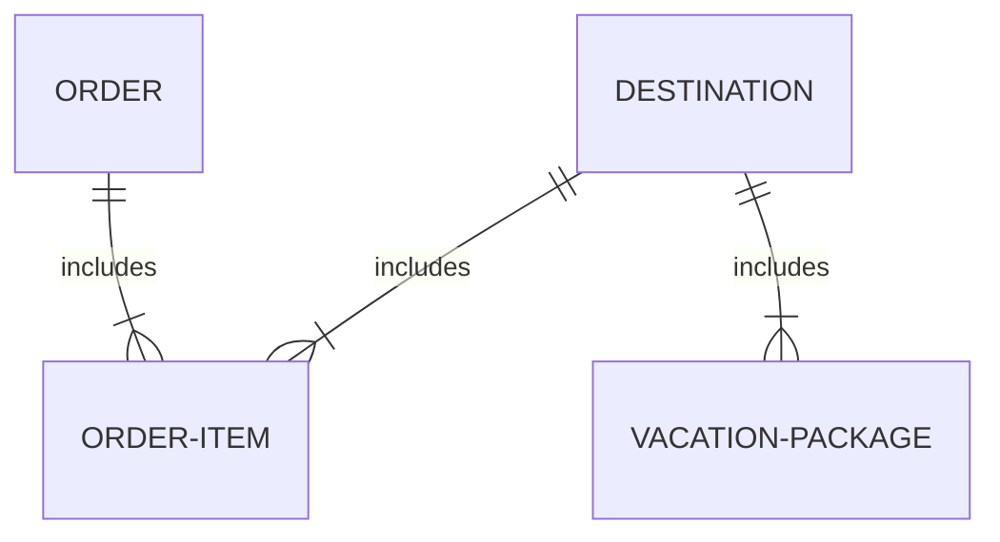
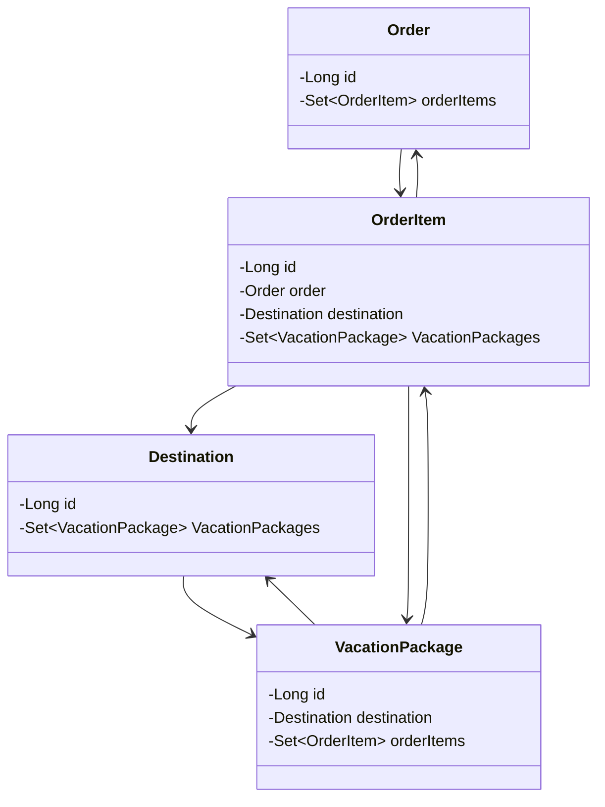

When persisting an order object in a one-to-many relationship in a spring backend, the "many" order item objects were not persisting to the database as expected.
In the end, the problem wasn't my code, but my assumptions.

<!--More-->
## Context
### Environment
This issue occurred during a Spring Boot backend project. I was to set up a simple backend following a layered design approach with these packages:
- Controller for mapping requests
- Dao for repositories that interact with the independent (non-hibernate managed) database
- Entities for holding and structuring the necessary data as it passes
- Services for handling logic/business logic

Using:
- Spring Boot
- JPA
- Lombok
- Rest Repositories
- MySQL Driver

I was not allowed to alter the Angular frontend or the database schema.
### Code
Standard, boring (I say this lovingly), and simple.
### Requirements
The project (which I did not conceive the overall concepts of) is an overly-simple site for purchasing destination packages at vacation destinations.
I don't think I'm allowed to disperse the UML/ERD diagrams for mapping the relationship, nor the frontend work that is not my own.
However, I have created a simple mermaid diagram to represent only the relevant relationships.

Note, these are not all of the entities or all of the relationships in the project. This is not taken from university material. I made this on my own.

Here's a simple self-made diagram to visualize the relevant relationships. Only the relevant properties are included.

## Behavior
### Expectations
From the front end, the expected behavior is to
1. Click a shopping cart icon to land on vacation destinations menu page.
2. Destinations populate from the backend.
3. Click on a destination to land on the vacation packages associated with that destination.
4. Vacation packages populate from the backend.
5. Add one or more vacation packages to the cart.
6. Click checkout to reach the checkout confirmation page.
7. Confirm the order to receive an order number.

The user interface is *minimal*. There are only two options on the landing page:
1. User icon for adding a customer.
2. Shopping cart icon for getting to the destinations menu.

Once the destinations menu is reached, there are no back buttons. Once a destination has been selected, there are no UI hints or explicit options to change the destination or go back to the destinations menu. The UI seems to encourage a single, linear path through the application. I get it. It's merely a dummy piece to facilitate a student backend project. Anyway, that single path seems to be to navigate to a destination, add a few packages, checkout, and that's it.

From the backend, I expected the `order-items` table in MySQL to populate with each selected vacation package. I was expecting multiple new rows in the table to corroborate with the amount of vacation packages that were selected and purchased in each order.

### Reality
I was only ever receiving a single entry in the `order-items` table per order, regardless of how many vacation packages were added to the cart.

Entities were mapped correctly for the required relationships. So it should have populated automatically upon persisting the order. Every other relationship was producing desired and intended results.

## Troubleshooting
Debug statements in my service class and cart entity showed that the set in which the collection of order items was held before persistence was only ever holding a single item.

### Hypothesis: The Set was busting my work
I thought that maybe, because of working with a set, and because of how the entities' id's were configured, that `Set` itself was to blame.

- Java Sets only hold unique entries. They automatically deduplicate recurring entries.
- My orderItems wouldn't receive a an id until persistence to the database due to using `@GeneratedValue(strategy=GenerationType.IDENTITY)`.
- OrderItems also couldn't be saved before saving the Order itself due to being on the "many" side of the one-to-many relationship.

Since the id fields were blank when each new `orderItem` was constructed and placed into the set, that deduplication was possibly pruning each set down to one entry.

#### Hypothetical fix
My project required me to use a Set instead of an alternative like a List (which would allow duplicate entries). Needing a workaround that still implemented `Set`, I:

- created an alternative, temporary ID (`tempId`) in `cartItem` entity with a random UUID generator.
- generated new `equals()` and `hashCode()` methods in `OrderItems` to override the defaults with `@Override`.
- set those methods to use `tempId` instead of the generated Id.

This procedure did not fix my issue, so I reverted the changes.

## Fix
### Serendipitous epiphany
I consulted the course's demonstration of a completed application's correct behavior, just in case I missed something crucial. The demo application's behavior was identical to my project's behavior. Despite multiple vacation packages existing in the order, the backend was only saving one new row in `order-items`.

My project clearly wasn't malfunctioning, but I needed to know how I'd ended up chasing my own tail.

>[!WARNING]
> I don't actually know the proper terminology to accurately
> describe JSON in plain language yet. Bear with me.

I looked into the JSON that was being sent in the request during checkout. I noticed that in the `orderItems` object reference, there was only a single next-level object reference where I expected there to be two (one for each selected vacation package). Furthermore, that object reference didn't even map to a vacation package, but to a destination. That `Destination` object reference then contained the two object references for the vacation packages I'd selected.

It was at that moment I began to suspect that I'd misunderstood how the application's behavior should reflect on the hierarchy or structure of the relationship.

#### Confirmation
I walked through a different purchase scenario:
1. I chose a destination from the destinations page.
2. I selected a couple of vacation packages to add to my order.
3. Instead of taking the option to checkout, I clicked again on the icon that loads the destinations page. Remember, there's no back button and the only apparent forward option is to checkout.
4. I selected a different destination.
5. I selected some vacation packages pertaining to the new destination.
6. I checked out with vacation packages from two different destinations in my cart.

***It worked.***

The debug code in the service confirmed that there were two objects in the set. Two object references in the checkout request JSON nested directly in the `orderItems` reference. Two new entries in the `order-items` table in the database, each sharing the foreign key entry for the order id.

**It was never broken in the first place**.

## Takeaways
I should have studied the guiding documents instead of making assumptions based on the UI.

The ERD and UML diagrams dictated how the backend was built. If I had taken a closer look at them to deduce the expected behavior, I would have realized that it was working properly in the first place.

Sure, the UI design appeared to imply something other than what the underlying app was actually doing. By being unintuitive, the UI fed the assumption that vacation packages, rather than destinations, would create new rows in the `order-items` table.

Still, I should have taken more time with those important documents instead of just using them to mindlessly build entities, as if it were a manual copy-paste exercise.

Silly mistake, really, but all mistakes are worth something.
